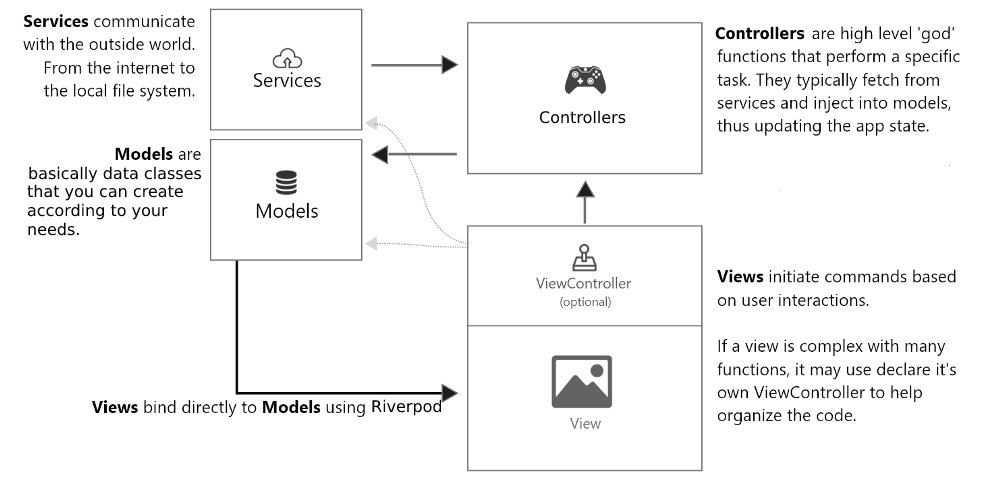

# Architecture

It uses Flutter to make the application native cross-platform and uses the MVC+S architecture pattern and Provider design pattern:

## Model
Holds the state of the application and provides an API to access/filter/manipulate that data. Its concern is data encapsulation and management. It contains logic to structure, validate or compare different pieces of data that we call Domain Logic.

> _/lib/models/_

## View
Views are all the Widgets and Pages within the Flutter Application. These views may contain a “view controller” themselves, but that is still considered part of the view application tier.

> _/lib/pages/_

## Controller
The controller layer is represented by various Commands which contain the Application Logic of the app. Commands are used to complete any significant action within your app.

> _/lib/providers/_

## Services
Services fetch data from the outside world, and return it to the app. Commands call on services and inject the results into the model. Services do not touch the model directly.

> _/lib/services/_
